## 介绍

基于 vue3+vite 的 three.js 学习代码项目。

## 安装依赖

```sh
npm install
```

### 开发环境启动

```sh
npm run dev
```

### 部署打包

```sh
npm run build
```

### 效果图

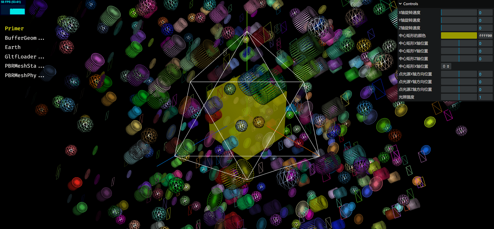
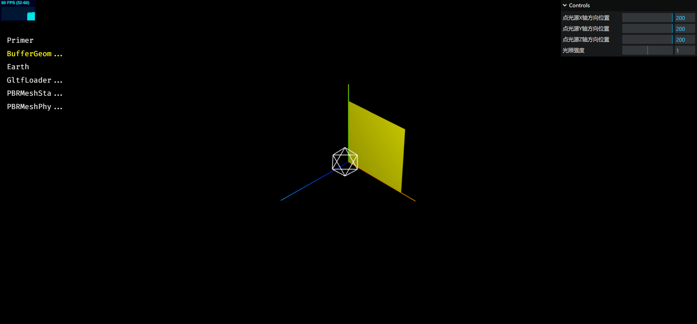
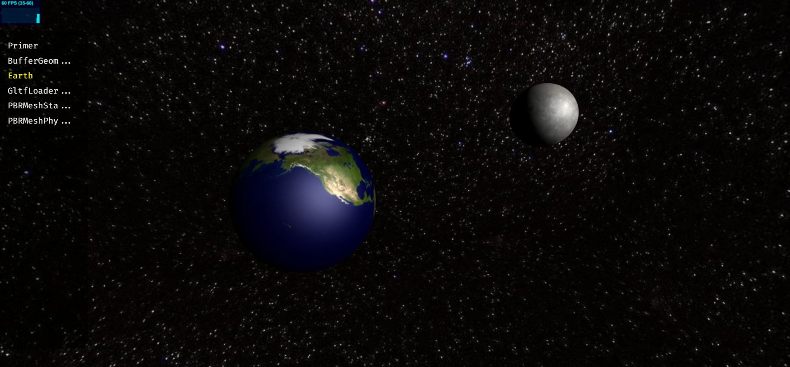

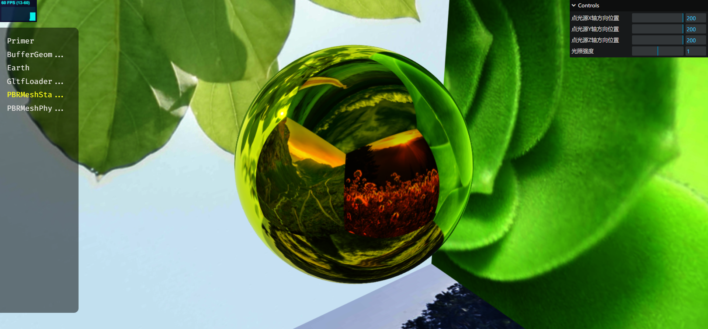
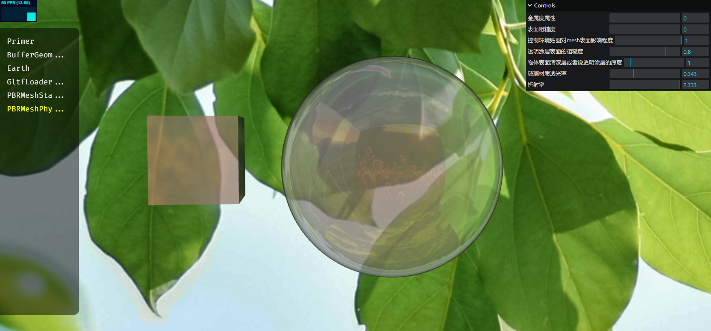

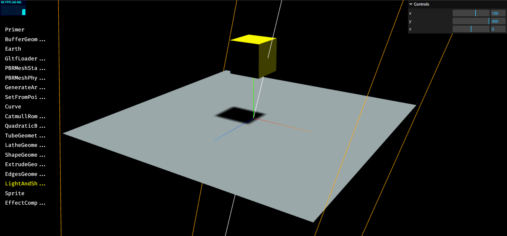


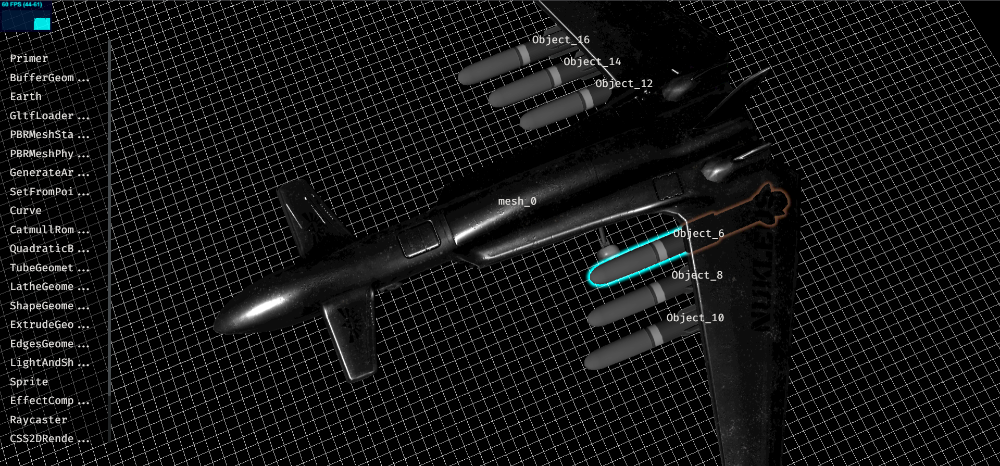
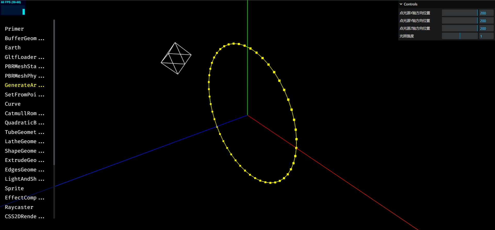
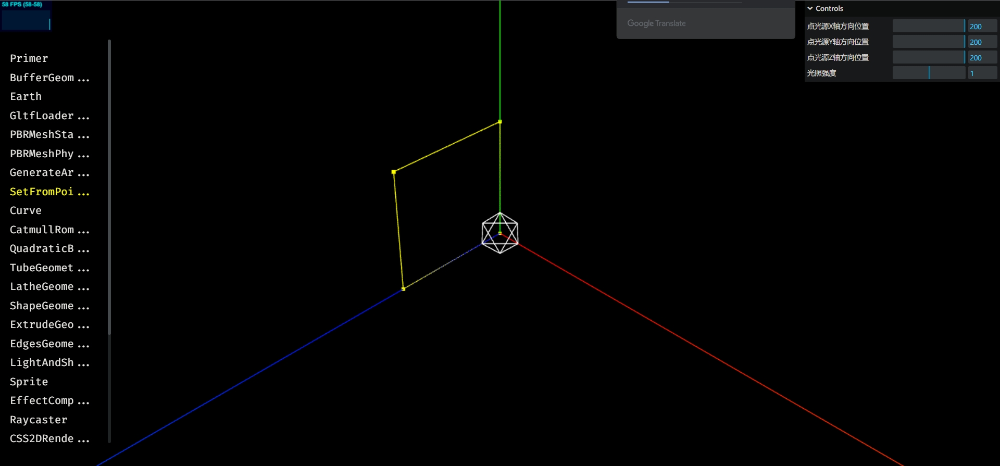
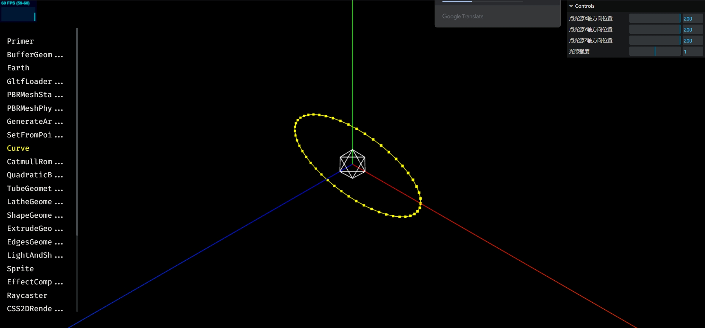
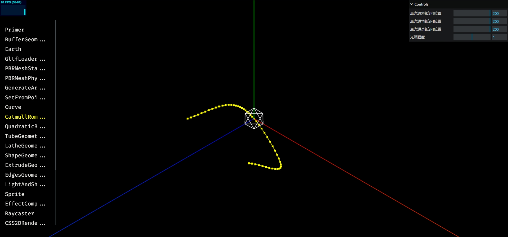
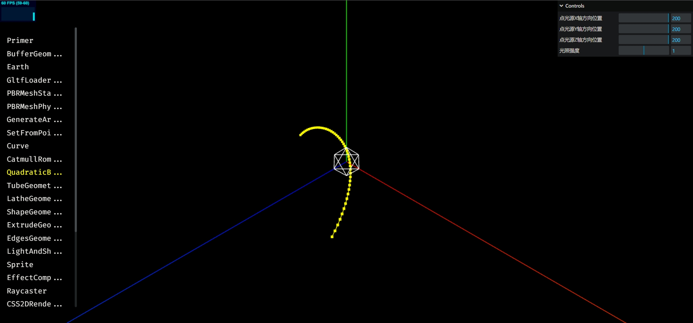
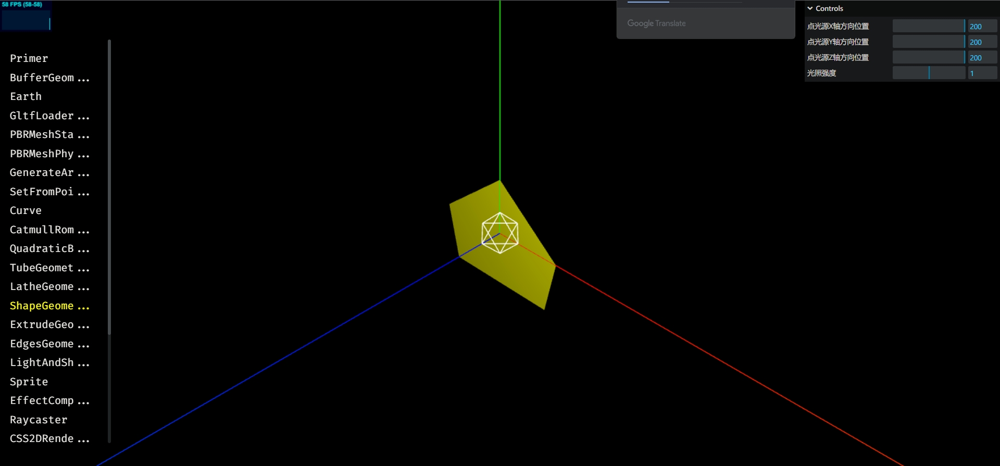
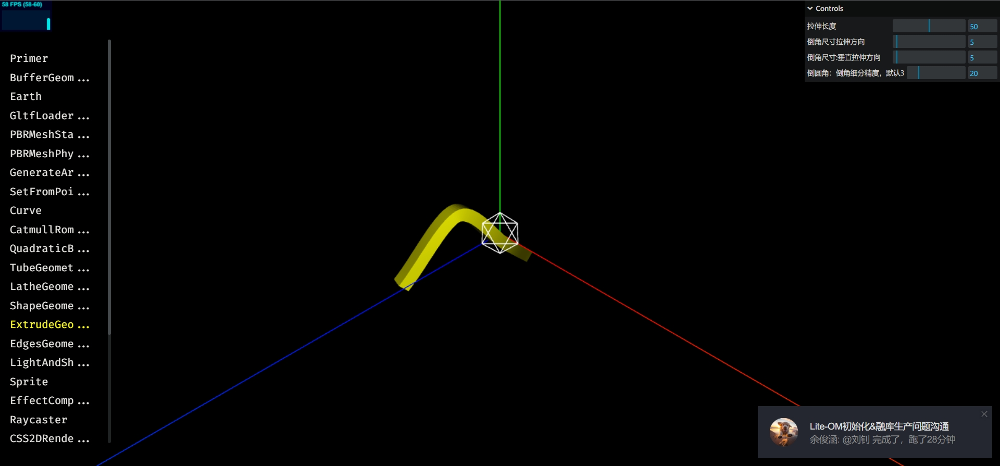
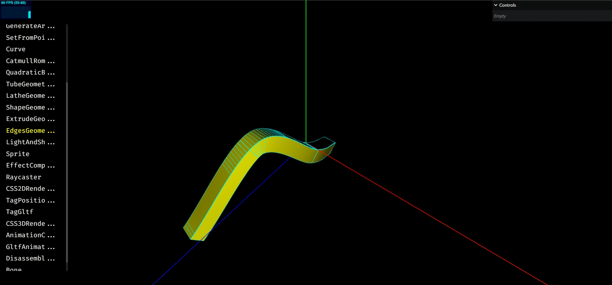
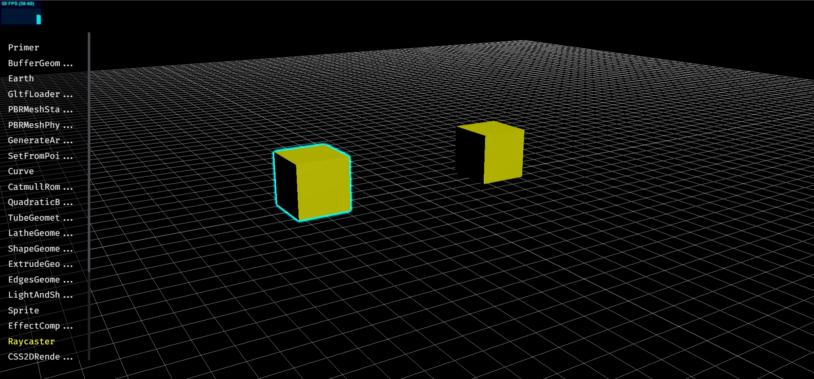
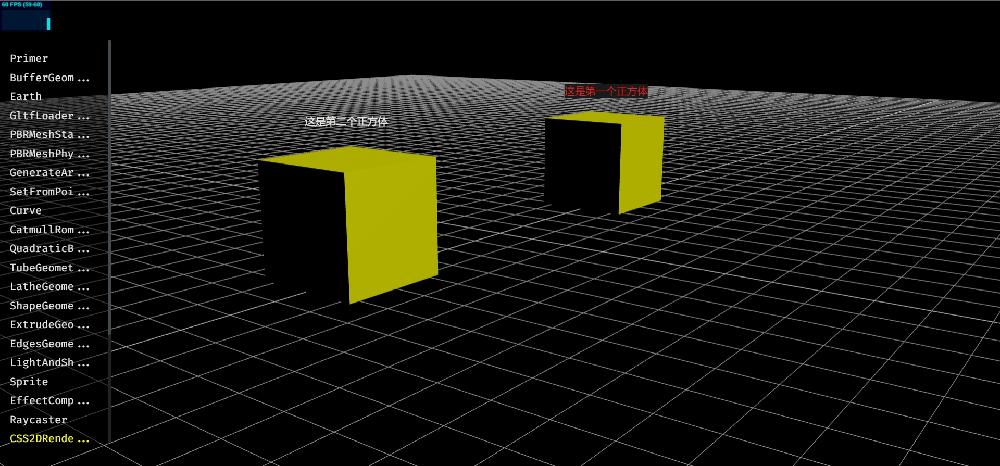
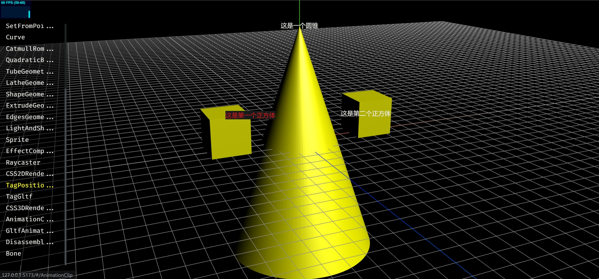
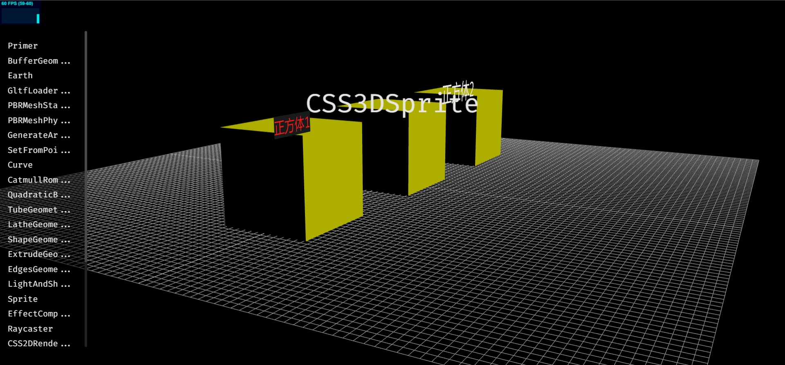
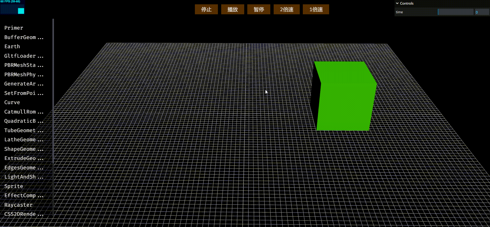
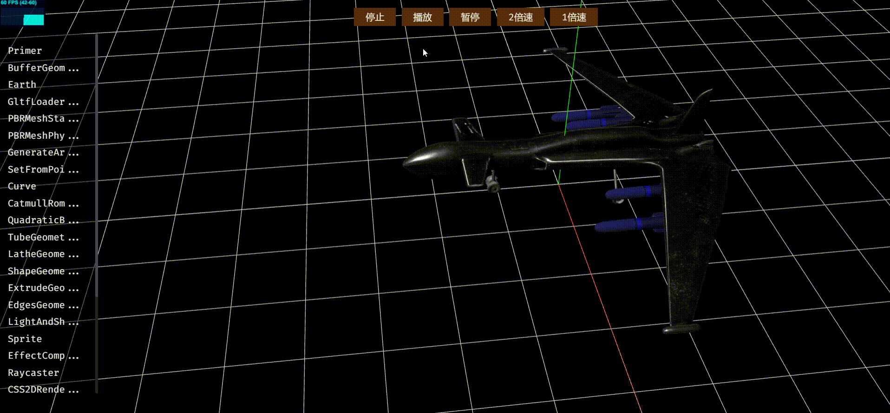
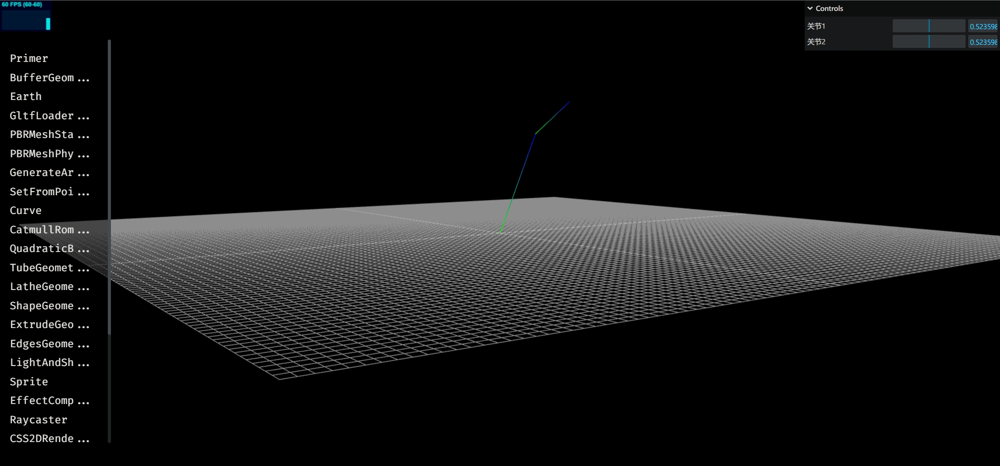

### 案例


### 遗留

生成曲线，几何体章节下的：

1. 一段曲线颜色渐变
2. Color 颜色渐变插值
3. 查看或设置 gltf 几何体顶点
4. 山脉地形高度可视化

这几节暂时没有学习，后面补学后删除该遗留批注
### 引用
[http://www.webgl3d.cn/pages/4a14ce/](http://www.webgl3d.cn/pages/4a14ce/)